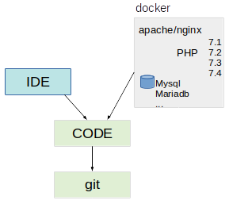

# Docker Configurations

The docker files contained here mainly build the different development images that we use to develop software. Mostly the software we need to have configured to be able to just work on the code. Usually that is the webserver and database. As we keep the code and IDE on our local machines.

Something like you can understand in [the next image](dockersetup.odg):

We can even have various containers running at the same time on different ports:

- http://localhost:3071/coreBOS
- http://localhost:3072/coreBOS

where both are accessing the same code but 3071 is using PHP 7.1 and 3072 is using PHP 7.2
